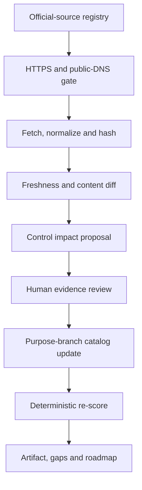

# JARVIS Ultimate frontier benchmark — initial assessment

**Assessment date:** 22 August 2026  
**Reviewed source head:** `0ebbb7d95614fc78698a0e85f68301c61dcb9f3a`  
**Controls:** 52 across 13 domains  
**Official comparator sources:** 28  
**Reproducible report digest:** `sha256:3443ba3db5803a6989476caa47663b350a17bc721a3f8cd563b509c5b677d139`

## Executive finding

JARVIS has a credible **governed and tested engineering foundation**, but it is not yet comparable with the production operating envelope exposed by the leading Microsoft and Google agent platforms. The strongest verified JARVIS work is governance, AI-risk control, deterministic orchestration, source admission and failure isolation. The decisive deficit is operational: no current control has provider-bound or production-proven evidence.

| Score | Result | Meaning |
|---|---:|---|
| Capability alignment | **39.85%** | Weighted maturity against the 52-control frontier envelope |
| Evidence-adjusted alignment | **35.07%** | Capability score discounted by evidence confidence |
| Provider-bound coverage | **0.00%** | No control has passed the provider-binding gate |
| Production-proven coverage | **0.00%** | No control has repeated production operating proof |

These figures score all verified work, including explicitly labeled source/test-verified open pull requests. Unmerged or local-tested work receives no deployment credit. The latest Gemini canary failure remains a failure, not a partial provider success.

## Comparator envelope

The benchmark takes the strongest relevant public practice per control; it does not crown one company as universally best.

| Comparator | Publicly evidenced frontier used | JARVIS implication |
|---|---|---|
| Microsoft | Foundry and Agent Service for managed agents, tools, model choice, identity, networking, tracing, monitoring and evaluation; Azure Well-Architected; SDL; platform-engineering capability model; landing zones; GitHub supply-chain controls | Match the integrated managed runtime and build an internal platform operating model, not just orchestration source |
| Alphabet / Google | Gemini Enterprise Agent Platform for runtime, sessions, memory, IAM, evaluation and observability; Google Well-Architected; SAIF; SRE error budgets; DORA; software supply-chain security | Add provider-bound agent operations, continuous evals, SLO/error-budget discipline and source-to-runtime attestations |
| SoftBank | Public multi-agent long-term-memory operational verification; AITRAS visibility/evaluation/decision/configuration and GitOps optimization; Cristal and Sarashina enterprise/sovereign AI announcements | Use specialist handoffs and continuous resource decisions as design comparators, but treat announced scale and internal maturity as unverified until direct proof exists |
| NIST / SLSA | AI RMF and GenAI profile; SSDF and AI profile; SLSA 1.2 source/build requirements | Turn governance language into mapped controls, accountable evidence and signed supply-chain proof |

SoftBank press releases and the careers page have intentionally lower comparator confidence. They identify capabilities and disciplines worth benchmarking; they do not prove staffing, effectiveness, service levels or company-wide production maturity.

## Domain results

| Domain | Alignment | Evidence-adjusted | Finding |
|---|---:|---:|---|
| Team capability and governance | **54.74%** | 48.00% | Strong documentation, governance and learning fabric; ownership/capacity and adoption metrics remain incomplete |
| AI risk and safety | **54.55%** | 48.49% | Strong truth gates and authority controls; no full NIST mapping or continuous model-evaluation system |
| Agent orchestration | **50.48%** | 46.33% | Deterministic orchestration and tool boundaries are tested; managed runtime and provider operation are missing |
| Knowledge and context | **45.71%** | 39.64% | Provenance and capsules exist; managed memory, governed grounding and a full cross-session round trip are open |
| Software supply chain | **45.45%** | 39.98% | Pinned actions and source admission are strong; attestations, SBOM and deployment admission are incomplete |
| Security and identity | **45.00%** | 39.40% | Default-deny source controls exist; per-agent identity, private networking and provider readback do not |
| Software delivery | **42.86%** | 39.74% | Exact-head CI is real; branch-protection readback, DORA metrics and live promotion proof are absent |
| Data and durability | **40.00%** | 34.58% | Local hash-chain controls are tested; managed transactions and immutable external anchors are missing |
| Reliability and SRE | **39.09%** | 34.05% | Circuit breaking and failure registers exist; service SLOs, error budgets and restore proof do not |
| Platform engineering | **36.47%** | 31.67% | Governance patterns exist; self-service golden paths and developer adoption measures are immature |
| Observability and evaluation | **31.00%** | 25.62% | Receipts and lineage exist; distributed traces, quality evals and p50/p95/p99 runtime metrics are unproven |
| Production operations | **14.78%** | 13.23% | Packaging and deployment controls are designed, but there is no exact provider/model binding or live runtime |
| FinOps and sustainability | **10.67%** | 8.37% | Cost approval boundaries exist; hard provider caps, unit economics, dynamic optimization and sustainability metrics do not |

## Work already done that materially closes the frontier

1. JARVIS Alpha-Omega Five is implemented, admitted on `main`, tested 15/15 and exercised once in a bounded no-effect run.
2. JARVIS Ultimate v1.0 provides an interactive Google ADK/GenAI service foundation, authority kernel, Cloud Run packaging, learning ledger and local tests.
3. The v1.4 hardening, T20 governor, GCP Admin MCP and disabled adapter add tested permits, quarantine, replay/tamper defenses, exact tool contracts, WIF/lineage controls, zero-traffic deployment and rollback source—while remaining clearly labeled open/unmerged/provider-disabled.
4. Federation Airlock, Leak Guard and source-provenance controls create a meaningful exact-head CI and default-deny source boundary.
5. The continuous-learning, failure-register, capability-skill and documentation-first mechanisms are substantive team-capability assets.

## Highest-impact remaining gates

| Priority | Control | Current state | Evidence required to advance |
|---:|---|---|---|
| 1 | Exact provider/model binding | ABSENT | Repair machine identity, bind the exact approved model and pass two bounded semantic readbacks |
| 2 | Transactional effect/recovery state | DESIGNED | Managed transactional store; concurrency, restart and replay proof |
| 3 | Managed deployment/private IAM/runtime lineage | DESIGNED | Exact source→image→revision evidence, unauthenticated denial and private-IAM readback |
| 4 | External secrets/signing/key rotation | DESIGNED | Isolated signer and secret manager; rotate/revoke canary with no leakage |
| 5 | SLOs and error budgets | DESIGNED | Availability, latency, quality and recovery SLOs linked to release policy |
| 6 | Unit economics | ABSENT | Cost and value per useful completed job, including failure cost |
| 7 | Runtime telemetry | DESIGNED | p50/p95/p99 latency, error, retry, availability and saturation from repeated live runs |
| 8 | Traffic and rollback | DESIGNED | Zero-traffic deploy, bounded canary, rollback restoration and final traffic readback |
| 9 | SBOM/vulnerability management | DESIGNED | SBOM, scans, owners, remediation SLAs and critical-risk admission gate |
| 10 | DORA measurement | ABSENT | Deployment frequency, lead time, change failure, recovery and rework trends |
| 11 | Managed sessions/memory | SOURCE_IMPLEMENTED | Transactional session/memory binding with restart and isolation proof |
| 12 | AI evaluation/red team | SOURCE_IMPLEMENTED | Versioned datasets, adversarial tests, thresholds and exact-model release gates |

## Recommended delivery sequence

### P0 — truth and release lineage

- Refresh stale canonical records to the current source head.
- Restack PRs `#534 → #546 → #548 → #549`, rerun exact-head checks and rebind the disabled adapter to final identities.
- Obtain current GitHub ruleset/branch-protection readback.

### P1 — provider-bound minimum

- Repair the Google machine-identity route.
- Bind an authorized exact Gemini/Google model and pass two no-effect semantic canaries.
- Keep Workspace OAuth separate from Google Cloud IAM and prove each connector by scope/action.

### P2 — private production candidate

- Externalize signing, secrets, nonces, effects, recovery state, breaker state and the immutable high-water anchor.
- Produce signed build provenance and SBOM; admit an exact immutable image to a private zero-traffic revision.
- Prove denial, private IAM, semantic canaries, cost cap, rollback and exact traffic state before any promotion.

### P3 — measurable operating system

- Add continuous AI evaluations, full tracing and service telemetry.
- Operate SLO/error-budget, incident/postmortem and disaster-recovery policies.
- Publish DORA, unit-economics, developer-adoption and sustainability measures.

### P4 — continuous frontier learning

- Merge the read-only benchmark workflow under Airlock review.
- Observe three successful daily refreshes.
- Review the first real official-source delta through a purpose-branch catalog change and confirm that no source change auto-promotes JARVIS maturity.

## Continuous benchmark algorithm

The automated lane can read, hash, diff and propose. Only the reviewed lane can change sources, control mappings, targets or JARVIS evidence. This makes the system continuously current without turning a changed web page into an unreviewed self-modifying standard.

