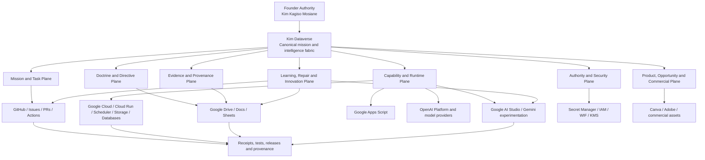
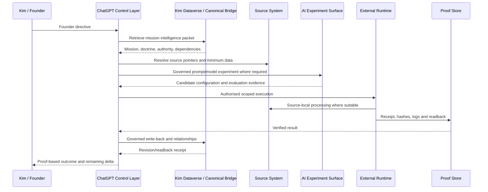

# Kim Dataverse Estate Map — ICT Control Edition

Status: SOURCE-CONSOLIDATED / ESTATE-INTEGRITY-CONTROLS-BOUND / PRIVATE-POINTERS-REDACTED
Owner and Final Authority: Kim Kagiso Mosiane
Audience: ICT operations, cloud, security, DevOps, data, integration, reliability and support teams

## Purpose

This document gives ICT a single, durable map of the Kim Dataverse estate so that every engineer understands the full environment before changing, supporting, securing or automating any component.

The Kim Dataverse is not a single application or database. It is a founder-controlled mission, evidence, authority, capability, runtime, learning, repair and commercial-intelligence estate distributed across several authorised systems.

## Estate at a glance

## Constitutional control

The estate is governed by these non-negotiable rules:

1. Kim Kagiso Mosiane is the owner and final authority.
2. The founder-controlled mission is authoritative.
3. Capability may change the execution route but may not silently reduce the required outcome.
4. A plan is not execution; code is not production until deployed, executed, read back and verified.
5. A configured schedule is not a verified triggered run.
6. A local mirror is not a canonical Dataverse update.
7. Completion requires execution, readback, validation, red-team review, receipt and mission-equivalence review.
8. Unresolved Mission Delta remains workforce-owned until closed, founder-amended or genuinely blocked after authorised alternatives are exhausted.
9. A persisted source version proves only an **as-of** observation; present-tense source truth requires a fresh provider read.
10. Source frontier, runtime-attestation frontier and provider-effect proof are independent dimensions. One may not silently inherit another's maturity or authority.
11. Historical attestations remain exact to the source version actually tested and are never rewritten forward.
12. Raw XLSX/OOXML serialization is not interpreted until cell type, shared-string, style, formula and sheet-identity semantics are decoded.

## KDV integrity and projection layer

The estate now includes an explicit integrity layer that strengthens the existing canonical bridge rather than replacing it:

- `config/kim-dataverse-schema-manifest-v1.json` — public-safe sheet/block/export identity manifest;
- private `KDV_SCHEMA_REGISTRY` — full provider-bound field/type registry;
- `config/kim-dataverse-projection-contract-v1.json` — source/runtime/provider truth-dimension contract;
- `config/kim-dataverse-consumer-map-v1.json` — consumers and required stronger evidence before using mutable projections;
- `evidenceops/kim_dataverse/xlsx_semantic.py` — format-aware OOXML decoder;
- `evidenceops/kim_dataverse/schema_contract.py` — typed field normalization and live-header validation;
- `evidenceops/kim_dataverse/projection_contract.py` — query-time currentness and compare-and-set preconditions;
- `evidenceops/kim_dataverse/writer_guard.py` — typed wrapper around the existing TruthGrid live-schema → mutation → independent-readback guard.

Mutable status tables are projections, not independent sources of truth. Append-only evidence and provider receipts outrank copied status prose. New writes are normalized through typed contracts; historical mixed-type records are preserved rather than destructively rewritten.

Excel export is a derived representation. Because XLSX worksheet names are limited to 31 characters, the current known transforms include:

- `FEDERATION_ADVERSARIAL_VALIDATION` → `FEDERATION_ADVERSARIAL_VALIDATI`
- `CHATBRIDGE_CHECKPOINT_GENERATIONS` → `CHATBRIDGE_CHECKPOINT_GENERATIO`

A raw `<v>` value in a shared-string cell (`t="s"`) is an index into `sharedStrings.xml`, not the displayed value. Export analysis must pass a format-aware semantic decoder before any corruption or provenance conclusion.

## Canonical logical entity model

ICT must treat the following as the canonical logical classes, even where actual provider tables or files use different names:

### Founder, mission and directive

- `KDV_FOUNDER` — identity, authority, protected sovereignty and preferences.
- `KDV_MISSION` — founder-controlled objectives, success definitions and maturity.
- `KDV_DIRECTIVE` — exact directives, versions, precedence and supersession.
- `KDV_TASK` — executable work, ownership, routes and proof requirements.
- `KDV_DEPENDENCY` — prerequisite and downstream relationships.
- `KDV_MISSION_DELTA` — unresolved difference between requested and verified outcome.

### Doctrine, evidence and artefacts

- `KDV_DOCTRINE` — constitutional, operational and mission-specific rules.
- `KDV_EVIDENCE` — evidence metadata, provenance, integrity and source pointers.
- `KDV_EVIDENCE_RELATIONSHIP` — corroboration, contradiction, dependency and statement-to-fact edges.
- `KDV_ARTIFACT` — documents, code, datasets, packages, models and outputs.
- `KDV_CANONICAL_POINTER` — pointers to authoritative files, repositories and records.

### Capability, authority and runtime

- `KDV_CAPABILITY` — tools, connectors, agents, APIs and verified capabilities.
- `KDV_AUTHORITY` — permissions, approval rules, side-effect classes and expiry.
- `KDV_RUNTIME` — workers, queues, schedulers, cloud services and local runtimes.
- `KDV_TRIGGER` — turn, dependency, event, schedule, repair and capability triggers.
- `KDV_RECEIPT` — execution, readback, verification and revision receipts.

### Learning, repair and risk

- `KDV_LESSON` — candidate and validated lessons.
- `KDV_REGRESSION_TEST` — tests proving behaviour changed.
- `KDV_INCIDENT` — harm, security, reliability and dilution incidents.
- `KDV_REPAIR` — repair transactions and non-repetition controls.
- `KDV_RISK` — legal, operational, security, commercial and evidence risks.
- `KDV_SYSTEM_HEALTH` — connector, trigger, queue, schema and runtime health.
- `KDV_SYNC_TRANSACTION` — pending, committed, failed and reconciled writes.

### Innovation, opportunity and value

- `KDV_OPPORTUNITY` — market, buyer, partnership and revenue opportunities.
- `KDV_INNOVATION` — new systems, methods, products and standards.
- `KDV_PRODUCT` — EvidenceOps products, offers, pricing and maturity.
- `KDV_CUSTOMER_OR_BUYER` — buyer classes, organisations and procurement pathways.
- `KDV_FUTURE_OPTION` — dormant branches and activation conditions.
- `KDV_VALUE_EVENT` — verified operational, strategic, commercial or legacy value.

## Physical estate map

### 1. Google Drive and Google Workspace

Role:
- sovereign source records;
- evidence and case workspaces;
- canonical bridges, ledgers, registers and control documents;
- source-local processing targets;
- preservation and backup surfaces.

Observed control assets include:
- `KIM DATAVERSE — Private Canonical Bridge v2.0`;
- `EVIDENCEOPS MASTER BIBLE — UPGRADED CONTROL EDITION v2.0`;
- PsyDataverse master doctrine, master dashboard and multiple specialised registers;
- Federation Omega master indexes and snapshots;
- case, legal, operational and innovation workspaces.

ICT handling rule:
- Drive retains sovereign source records;
- Dataverse stores minimum necessary metadata, relationships, hashes and pointers;
- raw evidence must not be copied unnecessarily;
- private Drive IDs and confidential paths must not be committed to public repositories.

### 2. GitHub — Federation Omega control plane

Role:
- code, tests, workflows, releases and provenance;
- branch and pull-request governance;
- external scheduling through GitHub Actions;
- deployment carriers and red-team checks;
- public leak guard and change receipts.

Current major platform components include:
- EvidenceOps sovereign runtime;
- durable AI ICT runtime overlay;
- Connector Foundry;
- Provenance Passport;
- In-Place Audit Omega;
- Innovation Engine;
- EvidenceOps MCP adapter;
- Google Drive bridge;
- WIF bootstrap and cloud-inventory controls;
- external provider-boundary watch;
- Kim DataVerse integrity/projection controls.

Control state:
- source architecture is materially present;
- CI and leak guard operate;
- typed KDV integrity controls are source-governed and require provider/live readback for operational claims;
- production cloud proof remains incomplete until its separate provider gates pass.

### 3. Google Cloud execution plane

Intended roles:
- Cloud Run services;
- Cloud Scheduler and durable condition monitoring;
- Artifact Registry;
- Secret Manager;
- Cloud KMS;
- PostgreSQL / Cloud SQL;
- Pub/Sub or task queues;
- object storage;
- logging, metrics and traces.

Known source contracts reference:
- one principal Google Cloud project;
- a South Africa region;
- repository-scoped GitHub OIDC Workload Identity Federation;
- separate deployer and runtime service accounts;
- the Superior Logic runtime service;
- the EvidenceOps sovereign runtime;
- EvidenceOps MCP and worker services.

Current proof state:
- source references exist;
- provider-native infrastructure inventory and runtime identity remain separately proof-gated;
- no production-readiness claim is authorised from source alone.

### 4. Google Apps Script

Role:
- lightweight Drive and Workspace triggers;
- source-local intake, file movement and control automation;
- low-volume workflows where Cloud Run is unnecessary.

Boundary:
- Apps Script is not the preferred durable runtime for high-volume or critical processing;
- recurring work must run outside ChatGPT;
- trigger configuration must be followed by an actual triggered-run receipt.

### 5. Google AI Studio

Role:
- Gemini prompt and model experimentation;
- rapid prototype development;
- multimodal capability testing;
- evaluation of prompts, model behaviour and candidate workflows before production deployment;
- creation of candidate model configurations, system instructions and reusable experiment artefacts.

Estate classification:
- first-class capability-development and experimentation surface;
- part of the Kim Dataverse resource pool;
- not the canonical mission-state, evidence or production-runtime store;
- outputs become trusted only after export, versioning, provenance capture, security review, regression testing and controlled deployment through an authorised production surface.

ICT controls:
- maintain a register of projects, experiments, models, prompts, files, API integrations and owners;
- distinguish personal experiments from governed EvidenceOps experiments;
- prevent raw secrets, confidential evidence and unapproved case material from being pasted into experiments;
- record model name/version, parameters, safety settings, source inputs, outputs, evaluations and export target;
- bind any production API use through an authorised Google Cloud project, IAM boundary and secret-management route;
- preserve prompt and evaluation artefacts in Drive or GitHub with stable identifiers and hashes;
- treat successful playground output as prototype evidence, not production proof.

Current proof state:
- Google AI Studio is mapped as an authorised resource-pool surface;
- account/project inventory, access model, governed experiment register, data-handling controls and production bindings remain to be fully read back and mapped.

### 6. OpenAI Platform and other AI providers

Role:
- model inference;
- agent and reasoning services;
- transcription and analysis where authorised;
- provider-independent AI capability behind governed adapters.

Security rule:
- raw keys never enter GitHub, Dataverse, Drive ledgers or chat outputs;
- runtime receives approved credentials only through a governed secret path;
- provider proof remains scoped to the exact canary/runtime/receipt that was read back.

### 7. Canva and Adobe

Role:
- reports, diagrams, hearing visuals and commercial materials;
- presentation layer only;
- not a canonical evidence or mission-state store.

Boundary:
- designs may visualise verified data but may not become the source of truth.

### 8. Email and communication surfaces

Role:
- source evidence;
- legal and operational communications;
- notification and approval channels.

Surfaces include Gmail and Microsoft Outlook.

Boundary:
- inbox content is evidence, not automatically structured mission state;
- secrets found in email must be contained and rotated through provider-native routes;
- external sending requires explicit authority where consequential.

### 9. Local and user-facing surfaces

Role:
- Windows 11 workstation;
- Edge and ChatGPT as reasoning and control interfaces;
- local Python and containers for bounded analysis and test work.

Boundary:
- ChatGPT is not the scheduler or durable runtime;
- local output is not canonical until written to an authorised system and read back;
- local mirrors must reconcile with the canonical bridge.

## Mission and data flow

## Trust and authority boundaries

| Boundary | Required control |
|---|---|
| Founder to system | exact directive preservation and precedence |
| Chat to external system | scoped capability, no raw secrets |
| GitHub to provider runtime | repository- and branch-scoped provider trust where applicable |
| Runtime to Secret Manager | service-specific least privilege |
| Runtime to source evidence | minimum necessary access and in-place processing |
| Google AI Studio to production | export, versioning, evaluation, security review and controlled deployment |
| Experiment surface to confidential data | approved minimum data only; no uncontrolled evidence or secrets |
| Public repository to private estate | aliases and redacted pointers only |
| Local mirror to canonical bridge | transactional sync and readback |
| Scheduled trigger to completion | actual run, artifact and receipt |
| Persisted source snapshot to present truth | fresh query-time provider read |
| Runtime attestation to later source | no inheritance; preserve tested source version |
| Provider subcapability to wider system | no scope or maturity inheritance |
| XLSX export to provider-native state | semantic decode plus sheet-identity validation |

## ICT operating states

Use only the highest state supported by evidence:

1. `DOCTRINE_ACTIVE`
2. `CAPABILITY_DISCOVERED`
3. `KIM_DATAVERSE_DISCOVERED`
4. `KIM_DATAVERSE_AUTHORITY_VERIFIED`
5. `KIM_DATAVERSE_SCHEMA_BOUND`
6. `KIM_DATAVERSE_READ_VERIFIED`
7. `KIM_DATAVERSE_WRITE_VERIFIED`
8. `KIM_DATAVERSE_BOUND`
9. `CASCADE_ENGINE_VERIFIED`
10. `COMPOUNDING_ENGINE_VERIFIED`
11. `MISSION_STATE_BOUND`
12. `SECURE_CAPABILITY_BOX_BOUND`
13. `EXTERNAL_TRIGGER_BOUND`
14. `LIVE_ORCHESTRATION_VERIFIED`
15. `CONTINUOUS_LEARNING_VERIFIED`

The KDV integrity layer does not promote the whole estate up this ladder. Source admission, private provider schema binding, typed-writer execution, projection canary and provider constraints are independently evidenced.

## ICT responsibilities

### Service desk and operations
- know which system is canonical for each record;
- never move evidence merely for convenience;
- preserve source and timestamps;
- escalate broken pointers and failed readback.

### Cloud engineering
- verify service accounts, IAM, secrets, runtime services and inventory;
- map AI experimentation production bindings to authorised cloud identities;
- prevent broad trust and static cloud keys;
- maintain provider-native receipts.

### DevOps
- use branches and PRs;
- keep public leak guard active;
- treat green CI as source qualification, not production proof;
- preserve artifacts, hashes and rollback routes;
- enforce required checks at the provider layer where authorised and proven.

### Security
- maintain the authority ledger and vault boundaries;
- contain exposed credentials;
- verify revocation and old-key rejection where applicable;
- govern experiment data, API credentials, file uploads and production exports;
- monitor least privilege and public/private leakage.

### Data and integration
- map actual provider schemas to KDV logical entities;
- bind full field/type metadata in `KDV_SCHEMA_REGISTRY`;
- use stable IDs and typed relationship edges;
- prevent duplicates, stale directives and orphaned pointers;
- validate writes and readback;
- treat mutable status tables as derived views rather than primary evidence.

### Reliability
- distinguish configured, running, as-of and currently read-back states;
- maintain trigger, queue and runtime health;
- test backup/restore and failure recovery;
- monitor Mission Delta closure and repeat failure;
- fail closed on source/revision compare-and-set mismatch.

## Known estate gaps

- full private field-level schema binding and readback must be maintained in `KDV_SCHEMA_REGISTRY`;
- mutable projection consumers require progressive rebinding to the derived truth contract;
- historical mixed physical types remain and should not be destructively normalized;
- provider-native required-check/branch-protection enforcement is separately proof-gated;
- Google AI Studio project, experiment, model, prompt, file, access and API-binding inventory remains incomplete;
- Google AI Studio data-handling, export, evaluation and production-promotion controls require provider-native readback;
- cloud service, secret, database, storage and queue readback remains incomplete;
- several historic workflow families remain under supersession review;
- several recurring tasks still require migration from legacy/internal scheduling to external runtimes;
- the private pointer and schema registries must remain synchronised with this public-safe estate map.

## Change-control rule

Any material addition, deletion, migration or reclassification in the estate must update:

1. this human-readable map;
2. the machine-readable estate registry;
3. the private canonical pointer/schema bridge;
4. dependency and authority relationships;
5. the relevant regression tests;
6. the estate revision receipt.

No team may treat an undocumented system, credential, runtime, repository, datastore, scheduler, AI experimentation surface or evidence surface as outside the estate.
