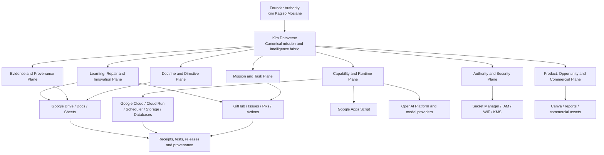
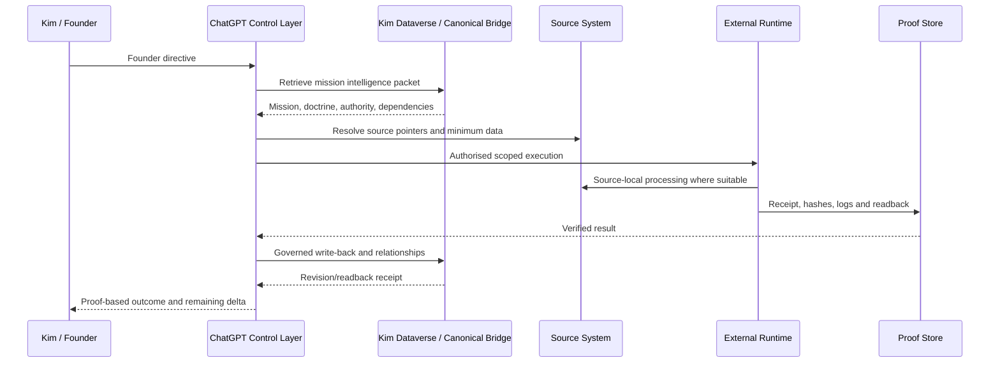

# Kim Dataverse Estate Map — ICT Control Edition

Status: SOURCE-CONSOLIDATED / ESTATE-PARTIALLY-VERIFIED / PRIVATE-POINTERS-REDACTED
Owner and Final Authority: Kim Kagiso Mosiane
Audience: ICT operations, cloud, security, DevOps, data, integration, reliability and support teams

## Purpose

This document gives ICT a single, durable map of the Kim Dataverse estate so that every engineer understands the full environment before changing, supporting, securing or automating any component.

The Kim Dataverse is not a single application or database. It is a founder-controlled mission, evidence, authority, capability, runtime, learning, repair and commercial-intelligence estate distributed across several authorised systems.

## Estate at a glance

## Constitutional control

The estate is governed by these non-negotiable rules:

1. Kim Kagiso Mosiane is the owner and final authority.
2. The founder-controlled mission is authoritative.
3. Capability may change the execution route but may not silently reduce the required outcome.
4. A plan is not execution; code is not production until deployed, executed, read back and verified.
5. A configured schedule is not a verified triggered run.
6. A local mirror is not a canonical Dataverse update.
7. Completion requires execution, readback, validation, red-team review, receipt and mission-equivalence review.
8. Unresolved Mission Delta remains workforce-owned until closed, founder-amended or genuinely blocked after authorised alternatives are exhausted.

## Canonical logical entity model

ICT must treat the following as the canonical logical classes, even where actual provider tables or files use different names:

### Founder, mission and directive

- `KDV_FOUNDER` — identity, authority, protected sovereignty and preferences.
- `KDV_MISSION` — founder-controlled objectives, success definitions and maturity.
- `KDV_DIRECTIVE` — exact directives, versions, precedence and supersession.
- `KDV_TASK` — executable work, ownership, routes and proof requirements.
- `KDV_DEPENDENCY` — prerequisite and downstream relationships.
- `KDV_MISSION_DELTA` — unresolved difference between requested and verified outcome.

### Doctrine, evidence and artefacts

- `KDV_DOCTRINE` — constitutional, operational and mission-specific rules.
- `KDV_EVIDENCE` — evidence metadata, provenance, integrity and source pointers.
- `KDV_EVIDENCE_RELATIONSHIP` — corroboration, contradiction, dependency and statement-to-fact edges.
- `KDV_ARTIFACT` — documents, code, datasets, packages, models and outputs.
- `KDV_CANONICAL_POINTER` — pointers to authoritative files, repositories and records.

### Capability, authority and runtime

- `KDV_CAPABILITY` — tools, connectors, agents, APIs and verified capabilities.
- `KDV_AUTHORITY` — permissions, approval rules, side-effect classes and expiry.
- `KDV_RUNTIME` — workers, queues, schedulers, cloud services and local runtimes.
- `KDV_TRIGGER` — turn, dependency, event, schedule, repair and capability triggers.
- `KDV_RECEIPT` — execution, readback, verification and revision receipts.

### Learning, repair and risk

- `KDV_LESSON` — candidate and validated lessons.
- `KDV_REGRESSION_TEST` — tests proving behaviour changed.
- `KDV_INCIDENT` — harm, security, reliability and dilution incidents.
- `KDV_REPAIR` — repair transactions and non-repetition controls.
- `KDV_RISK` — legal, operational, security, commercial and evidence risks.
- `KDV_SYSTEM_HEALTH` — connector, trigger, queue, schema and runtime health.
- `KDV_SYNC_TRANSACTION` — pending, committed, failed and reconciled writes.

### Innovation, opportunity and value

- `KDV_OPPORTUNITY` — market, buyer, partnership and revenue opportunities.
- `KDV_INNOVATION` — new systems, methods, products and standards.
- `KDV_PRODUCT` — EvidenceOps products, offers, pricing and maturity.
- `KDV_CUSTOMER_OR_BUYER` — buyer classes, organisations and procurement pathways.
- `KDV_FUTURE_OPTION` — dormant branches and activation conditions.
- `KDV_VALUE_EVENT` — verified operational, strategic, commercial or legacy value.

## Physical estate map

### 1. Google Drive and Google Workspace

Role:
- sovereign source records;
- evidence and case workspaces;
- canonical bridges, ledgers, registers and control documents;
- source-local processing targets;
- preservation and backup surfaces.

Observed control assets include:
- `KIM DATAVERSE — Private Canonical Bridge v2.0`;
- `EVIDENCEOPS MASTER BIBLE — UPGRADED CONTROL EDITION v2.0`;
- PsyDataverse master doctrine, master dashboard and multiple specialised registers;
- Federation Omega master indexes and snapshots;
- case, legal, operational and innovation workspaces.

ICT handling rule:
- Drive retains sovereign source records;
- Dataverse stores minimum necessary metadata, relationships, hashes and pointers;
- raw evidence must not be copied unnecessarily;
- private Drive IDs and confidential paths must not be committed to public repositories.

### 2. GitHub — Federation Omega control plane

Role:
- code, tests, workflows, releases and provenance;
- branch and pull-request governance;
- external scheduling through GitHub Actions;
- deployment carriers and red-team checks;
- public leak guard and change receipts.

Current major platform components include:
- EvidenceOps sovereign runtime;
- durable AI ICT runtime overlay;
- Connector Foundry;
- Provenance Passport;
- In-Place Audit Omega;
- Innovation Engine;
- EvidenceOps MCP adapter;
- Google Drive bridge;
- WIF bootstrap and cloud-inventory controls;
- external provider-boundary watch.

Control state:
- source architecture is materially present;
- CI and leak guard operate;
- production cloud proof remains incomplete until WIF, repository variables and inventory readback pass.

### 3. Google Cloud execution plane

Intended roles:
- Cloud Run services;
- Cloud Scheduler and durable condition monitoring;
- Artifact Registry;
- Secret Manager;
- Cloud KMS;
- PostgreSQL / Cloud SQL;
- Pub/Sub or task queues;
- object storage;
- logging, metrics and traces.

Known source contracts reference:
- one principal Google Cloud project;
- a South Africa region;
- repository-scoped GitHub OIDC Workload Identity Federation;
- separate deployer and runtime service accounts;
- the Superior Logic runtime service;
- the EvidenceOps sovereign runtime;
- EvidenceOps MCP and worker services.

Current proof state:
- source references exist;
- WIF provider remains unverified;
- required GitHub cloud variables were previously empty;
- provider-native infrastructure inventory has not yet produced a verified artifact;
- no production-readiness claim is authorised.

### 4. Google Apps Script

Role:
- lightweight Drive and Workspace triggers;
- source-local intake, file movement and control automation;
- low-volume workflows where Cloud Run is unnecessary.

Boundary:
- Apps Script is not the preferred durable runtime for high-volume or critical processing;
- recurring work must run outside ChatGPT;
- trigger configuration must be followed by an actual triggered-run receipt.

### 5. OpenAI Platform and other AI providers

Role:
- model inference;
- agent and reasoning services;
- transcription and analysis where authorised;
- provider-independent AI capability behind governed adapters.

Observed structure:
- more than one OpenAI organisation/project context exists;
- dedicated environment separation was not fully verified;
- historical plaintext API-key exposure was identified in email;
- replacement-key creation, secret binding, old-key revocation and rejection canaries remain incompletely verified.

Security rule:
- raw keys never enter GitHub, Dataverse, Drive ledgers or chat outputs;
- runtime receives secret references through Secret Manager or equivalent vault;
- exposed credentials remain compromised until provider-native revocation and rejection are proven.

### 6. Canva and Adobe

Role:
- reports, diagrams, hearing visuals and commercial materials;
- presentation layer only;
- not a canonical evidence or mission-state store.

Boundary:
- designs may visualise verified data but may not become the source of truth.

### 7. Email and communication surfaces

Role:
- source evidence;
- legal and operational communications;
- notification and approval channels.

Surfaces include Gmail and Microsoft Outlook.

Boundary:
- inbox content is evidence, not automatically structured mission state;
- secrets found in email must be contained, rotated and removed only after safe revocation;
- external sending requires explicit authority where consequential.

### 8. Local and user-facing surfaces

Role:
- Windows 11 workstation;
- Edge and ChatGPT as reasoning and control interfaces;
- local Python and containers for bounded analysis and test work.

Boundary:
- ChatGPT is not the scheduler or durable runtime;
- local output is not canonical until written to an authorised system and read back;
- local mirrors must reconcile with the canonical bridge.

## Mission and data flow

## Trust and authority boundaries

| Boundary | Required control |
|---|---|
| Founder to system | exact directive preservation and precedence |
| Chat to external system | scoped capability, no raw secrets |
| GitHub to Google Cloud | repository- and branch-restricted WIF |
| Runtime to Secret Manager | service-specific least privilege |
| Runtime to source evidence | minimum necessary access and in-place processing |
| Public repository to private estate | aliases and redacted pointers only |
| Local mirror to canonical bridge | transactional sync and readback |
| Scheduled trigger to completion | actual run, artifact and receipt |

## ICT operating states

Use only the highest state supported by evidence:

1. `DOCTRINE_ACTIVE`
2. `CAPABILITY_DISCOVERED`
3. `KIM_DATAVERSE_DISCOVERED`
4. `KIM_DATAVERSE_AUTHORITY_VERIFIED`
5. `KIM_DATAVERSE_SCHEMA_BOUND`
6. `KIM_DATAVERSE_READ_VERIFIED`
7. `KIM_DATAVERSE_WRITE_VERIFIED`
8. `KIM_DATAVERSE_BOUND`
9. `CASCADE_ENGINE_VERIFIED`
10. `COMPOUNDING_ENGINE_VERIFIED`
11. `MISSION_STATE_BOUND`
12. `SECURE_CAPABILITY_BOX_BOUND`
13. `EXTERNAL_TRIGGER_BOUND`
14. `LIVE_ORCHESTRATION_VERIFIED`
15. `CONTINUOUS_LEARNING_VERIFIED`

Current overall estate maturity:

`DOCTRINE_ACTIVE / DRIVE_BRIDGE_DISCOVERED / GITHUB_CONTROL_PLANE_ACTIVE / CLOUD_PROVIDER_BOUNDARY_UNVERIFIED / DATAVERSE_FULL_BINDING_UNVERIFIED`

## ICT responsibilities

### Service desk and operations
- know which system is canonical for each record;
- never move evidence merely for convenience;
- preserve source and timestamps;
- escalate broken pointers and failed readback.

### Cloud engineering
- verify WIF, service accounts, IAM, secrets, runtime services and inventory;
- prevent broad trust and static cloud keys;
- maintain provider-native receipts.

### DevOps
- use branches and PRs;
- keep public leak guard active;
- treat green CI as source qualification, not production proof;
- preserve artifacts, hashes and rollback routes.

### Security
- maintain the authority ledger and vault boundaries;
- contain exposed credentials;
- verify revocation and old-key rejection;
- monitor least privilege and public/private leakage.

### Data and integration
- map actual provider schemas to KDV logical entities;
- use stable IDs and relationship edges;
- prevent duplicates, stale directives and orphaned pointers;
- validate writes and readback.

### Reliability
- distinguish configured, running and verified states;
- maintain trigger, queue and runtime health;
- test backup/restore and failure recovery;
- monitor Mission Delta closure and repeat failure.

## Known estate gaps

- actual Dataverse environment, authority, schema, read and write route are not fully bound;
- private canonical bridge exists, but a complete provider-native schema map is not yet verified;
- Google Cloud WIF and infrastructure inventory remain incomplete;
- cloud service, secret, database, storage and queue readback remains incomplete;
- exposed OpenAI keys require provider-native closure proof;
- several historic NEXUS, PFRD and live-thread workflows remain under supersession review;
- several recurring tasks still require migration from legacy/internal scheduling to external runtimes;
- a private pointer registry must remain synchronised with this public-safe estate map.

## Change-control rule

Any material addition, deletion, migration or reclassification in the estate must update:

1. this human-readable map;
2. the machine-readable estate registry;
3. the private canonical pointer bridge;
4. dependency and authority relationships;
5. the relevant regression tests;
6. the estate revision receipt.

No team may treat an undocumented system, credential, runtime, repository, datastore, scheduler or evidence surface as outside the estate.
